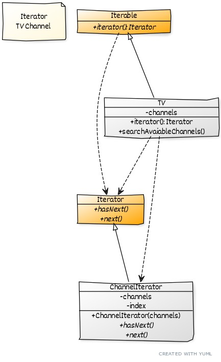
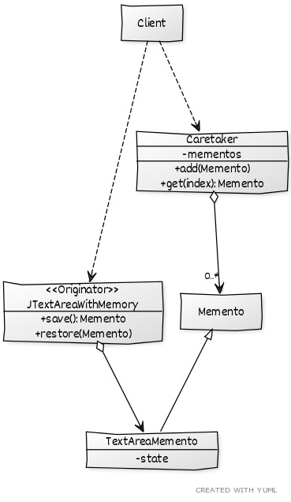
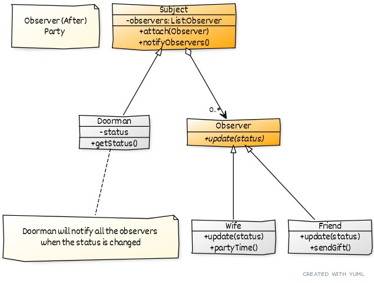
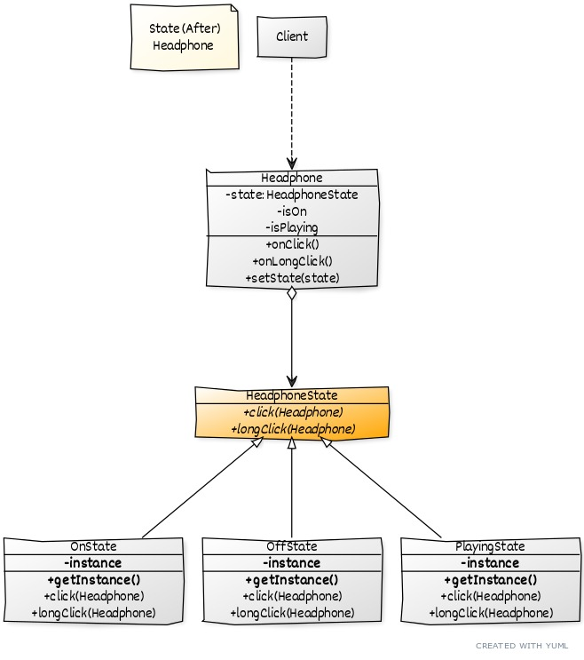
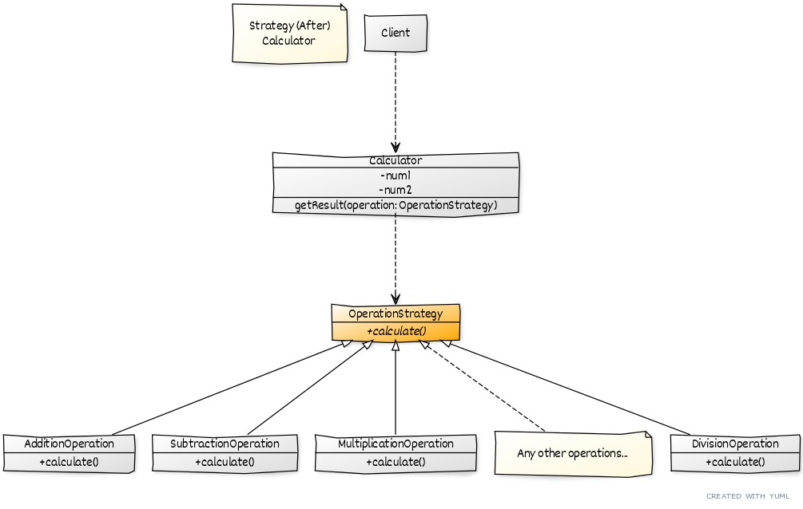
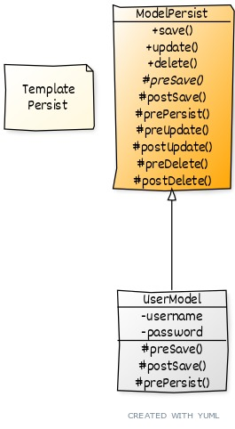

# Design Pattern Behavioral

* Chain of Responsibility
* Command
* Iterator
* Memento
* Observer
* State
* Strategy
* Template

#
### Chain of Responsibility

Evita acoplar o remetente de uma requisição ao seu destinatário ao dar a mais de um objeto a chance de servir a 
requisição. Compõe os objetos em cascata e passa a requisição pela corrente até que um objeto a sirva.

* Possuir classe concreta `Bill`, que deva conter uma propriedade chamada `next` do tipo `Bill` e dois construtores
    * Construtor que receba um Integer
    * Construtor que receba um Integer e um `Bill` (next)
* Possuir uma classe concreta chamada `Dispenser`, que contenha 2 construtores. O primeiro deve estar vazio, 
e o segundo deve ter um parametro do tipo array de `Bill`
    * Conter propriedade `chain` do tipo `Bill`
    * Construtor vazio: `this(new Bill(100), new Bill(50), new Bill(25), new Bill(10), new Bill(5), new Bill(1));`
    * Construtor com parâmetro: 
        * Percorrer array com os valores definidos no construtor vazio: `this(new Bill(100), new Bill(50), new Bill(25), new Bill(10), new Bill(5), new Bill(1));`
        * Vai configurar o próximo valor a ser executado
        * Vai configurar o valor de `chain` como o primeiro valor passado no construtor, no caso é o 100
* O método `withdraw` deve receber como parâmetro o valor total de notas a serem retiradas e chamar o método `execute` de `Bill`
* Com isso, evitaremos ter que fazer várias validações com `if` para cada tipo de nota

#
### Command

Encapsular uma requisição como um objeto, permitindo que clientes parametrizem diferentes requisições, filas
ou requisições de log, e suportar operações reversíveis.

* Possuir uma interface chamada `Command`, onde essa interface deve ser implementada pelas classes `TurnLightOffCommand` e
`TurnLightOnCommand`
* As classes `TurnLightOffCommand` e `TurnLightOnCommand` devem possuir uma propriedade do tipo `GenericLight` chamada
de `light`, e um construtor que receba um objeto do tipo `GenericLight`. O valor recebido pelo construtor, será atribuido
a propriedade `light`. 
* `GenericLight` deve ser uma interface implementada pelas classes `PhillipsHueLight` e `XiaomiLight`.
* Qnd for chamado o método `command.execute();`, a aplicação executará `this.light.turnOff();`, e com isso será verificado
se o `this.light` é do tipo `PhillipsHueLight` ou `XiaomiLight`. 
*De acordo com o tipo, a implementação desejara será executada.

#
### Iterator

Prover uma maneira de acessar os elementos de um objeto agregado seqüencialmente sem expor sua representação interna.

* Possuir classe `TV` que implemente `java.util.Iterator`
* A classe `TV` deve ter uma propriedade chamada `channels`, que deve receber todos os canais de forma aleatória
* Sobrescrever método `iterator` na classe `TV`, retornando um `new ChannelIterator(channels)`
* A classe `ChannelIterator` também deve implementar `java.util.Iterator`
* Com isso, ao instanciar uma `TV`, é possível fazer a iteração em cima da própria `TV`
    * `for (Integer channel: tv) { .... `
* Em outras palavras, você não consegue acessar os objetos diretamente dentro do objeto `TV`, mas consegue percorrer os 
elementos

#
### Memento

Sem violar o encapsulamento, capturar e externalizar o estado interno de um objeto para que o objeto possa ter esse 
estado restaurado posteriormente.

* Possuir classe `TextAreaWithMemory`, onde será responsável por criar um memento no método `save`, e recupera-lo no 
método `restore`
* A classe `TextAreaWithMemory` deve agir como originator
* Possuir `Caretaker`, que deve guardar a lista de mementos.
    * O método `add` deve adicionar um memento à lista de mementos
    * O método `get` deve recuperar o memento da lista de mementos
* Uso:
    * Instanciar `TextAreaWithMemory originator = new TextAreaWithMemory(5, 10);`
    * Instanciar `new Caretaker();`
    * O originator deve ser passado para o `Caretaker()`
    * De acordo com cada método chamado do `originator`, será adicionado um novo memento à lista de mementos, ou será
    retornado para o item anterior.
    * Ex: `caretaker.add(originator.save());` ou `originator.restore((TextAreaWithMemory.TextAreaMemento) caretaker.get(mementosList.getSelectedIndex()));`

    
#
### Observer

Definir uma dependência um-para-muitos entre objetos para que quando um objeto mudar de estado, todos os seus dependentes 
sejam notificados e atualizados automaticamente.

* Possuir interface chama `Observer` com o método `update`
* Possuir classe abstrata `Subject` que possuem uma lista do tipo `Observer`, com os métodos `add` e `notifyObservers`
    * `add` -> Adiciona um observer na lista de observers
    * `notifyObservers` -> Varre a lista de observers e os notifica
* O objeto `Doorman` deve estender de `Subject`
* Os objetos `Friend` e `Wife` devem implementar `Observer`
* Ao mudar o status `doorman.setStatus(true);`, todos os observeres serão notificados.

#
### State

Permitir a um objeto alterar o seu comportamento quanto o seu estado interno mudar. O objeto irá aparentar mudar de classe.

* Possuir interface `HPState`
* Possuir duas classes concretas `PlayingState`, `OffState` e `OnState` que implementam `HPState`
* Todas as classes concretas devem possuir um singleton
     * `private static final HPState instance = new OffState();`
     * `private static final HPState instance = new OnState();`
     * `private static final HPState instance = new PlayingState();`
* A classe `HeadPhone` deve possuir uma propriedade do tipo `HPState` chamada de state. A partir dela será possivel saber
o atual estado de `HeadPhone`
* Ao instanciar o objeto `HeadPhone`, sera possivel trocar os estados ao invocar os métodos `onLongClick` e `onClick`
* Para trocar o estado, basta chamar a propriedade `state`, chamando um de seus metodos e passando a referência `this`
    * `state.longClick(this);`
    * `state.click(this);`

#
### Strategy

Definir uma família de algoritmos, encapsular cada um, e fazê-los intercambiáveis. Strategy permite que algoritmos
mudem independentemente entre clientes que os utilizam.

* Possuir uma interface chamada `OperationStrategy` e tenha um método chamado `calculate`
* Possuir classes `SubtractionOperation`, `MultiplicationOperation`, `DivisionOperation` e `AdditionOperation` e devem
implementar `OperationStrategy`
* Possuir classe `Calculator`, que deve possuir método `getResult`, e esse metodo recebe como parâmetro `OperationStrategy`
* O método `getResult`, deve chamar o método `calculate`
* A classe `Calculator` também deve receber 2 parâmetros.
* Ao instanciar `Calculator`, e chamar o `getResult` passsando uma classe concreta `calc.getResult(new AdditionOperation())`
como parâmetro, a aplicação identificará qual implementação deve ser chamada. 

#
### Template

Definir o esqueleto de um algoritmo dentro de uma operação, deixando alguns passos a serem preenchidos
pelas subclasses. Template Method permite que suas subclasses redefinam certos passos de um algoritmo
sem mudar sua estrutura.

* Possuir classe abstrata chamada `ModelPersist` que servirá como template de métodos
* Possuir uma classe concreta chamada `UserModel`, que deva estender de `ModelPersist`
* Para usar esse template, basta instanciar `new UserModel("User", "password");` e chamar os métodos desejados

