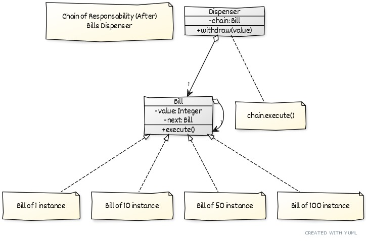
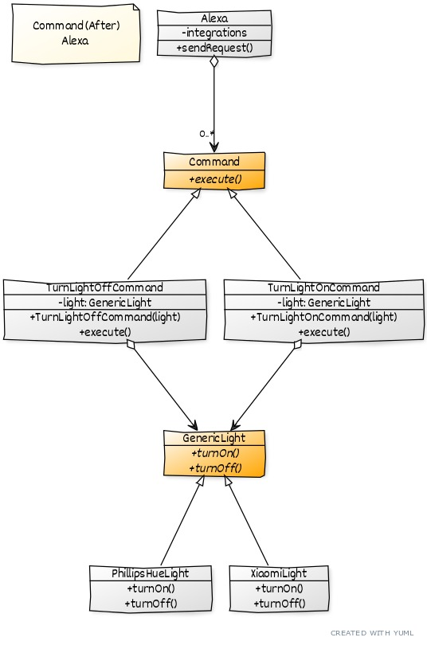

# Design Pattern Behavioral

* Chain of Responsibility
* Command
* Iterator
* Memento
* Observer
* State
* Strategy
* Template

#
### Chain of Responsibility

Evita acoplar o remetente de uma requisição ao seu destinatário ao dar a mais de um objeto a chance de servir a 
requisição. Compõe os objetos em cascata e passa a requisição pela corrente até que um objeto a sirva.

* Possuir classe concreta `Bill`, que deva conter uma propriedade chamada `next` do tipo `Bill` e dois construtores
    * Construtor que receba um Integer
    * Construtor que receba um Integer e um `Bill` (next)
* Possuir uma classe concreta chamada `Dispenser`, que contenha 2 construtores. O primeiro deve estar vazio, 
e o segundo deve ter um parametro do tipo array de `Bill`
    * Conter propriedade `chain` do tipo `Bill`
    * Construtor vazio: `this(new Bill(100), new Bill(50), new Bill(25), new Bill(10), new Bill(5), new Bill(1));`
    * Construtor com parâmetro: 
        * Percorrer array com os valores definidos no construtor vazio: `this(new Bill(100), new Bill(50), new Bill(25), new Bill(10), new Bill(5), new Bill(1));`
        * Vai configurar o próximo valor a ser executado
        * Vai configurar o valor de `chain` como o primeiro valor passado no construtor, no caso é o 100
* O método `withdraw` deve receber como parâmetro o valor total de notas a serem retiradas e chamar o método `execute` de `Bill`
* Com isso, evitaremos ter que fazer várias validações com `if` para cada tipo de nota

#
### Command

Encapsular uma requisição como um objeto, permitindo que clientes parametrizem diferentes requisições, filas
ou requisições de log, e suportar operações reversíveis.

* Possuir uma interface chamada `Command`, onde essa interface deve ser implementada pelas classes `TurnLightOffCommand` e
`TurnLightOnCommand`
* As classes `TurnLightOffCommand` e `TurnLightOnCommand` devem possuir uma propriedade do tipo `GenericLight` chamada
de `light`, e um construtor que receba um objeto do tipo `GenericLight`. O valor recebido pelo construtor, será atribuido
a propriedade `light`. 
* `GenericLight` deve ser uma interface implementada pelas classes `PhillipsHueLight` e `XiaomiLight`.
* Qnd for chamado o método `command.execute();`, a aplicação executará `this.light.turnOff();`, e com isso será verificado
se o `this.light` é do tipo `PhillipsHueLight` ou `XiaomiLight`. 
*De acordo com o tipo, a implementação desejara será executada.

#
### Iterator

#
### Memento

#
### Observer

#
### State

#
### Strategy

#
### Template